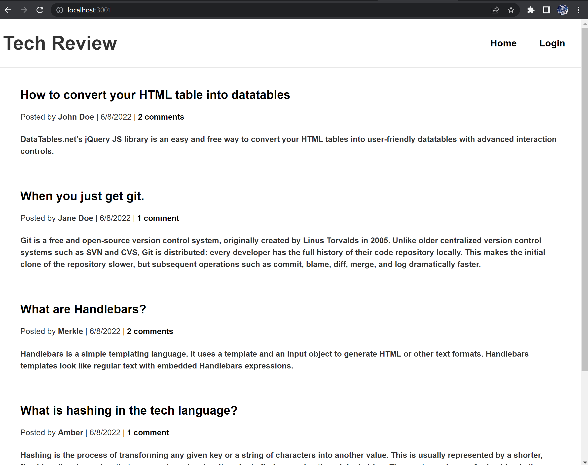
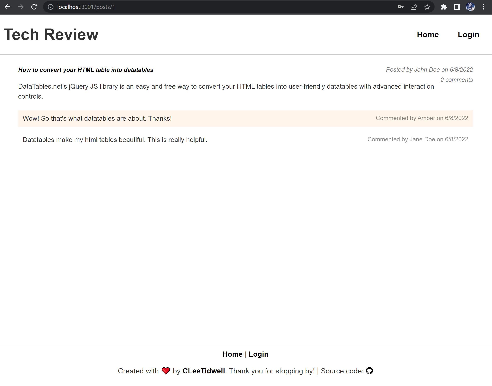

# Justanothertechblog
Week 14 Model-View-Controller (MVC): Tech Blog

## Description
 a CMS-style blog site similar to a Wordpress site, where developers can publish their blog posts and comment on other developers’ posts as well.

## Table of Contents
* [Installation](#installation)
* [Usage](#usage)
* [Technologies](#technologies)
* [License](#license)
* [Contact](#contact)

## Installation
Clone the repo to your local machine. To use this application, please run the following command:

git clone

And then run the following commands to install the dependencies:

npm install

## Usage

Run 
mysql -u root -p 
-> enter your mysql shell password, then run source db/schema.sql, and quit. 
Run node seeds/index.js to seed the database. 

Type the following command in your termimal:

npm start

Then open your browser and type http://localhost:3001/ to run this application on your local machine.

Link to deployed site https://justanothertechblog.herokuapp.com/

## Technologies
- HTML
- CSS
- Javascript
- NodeJS
- ExpressJS

## License

---
### Contact
CTidwell106@gmail.com
